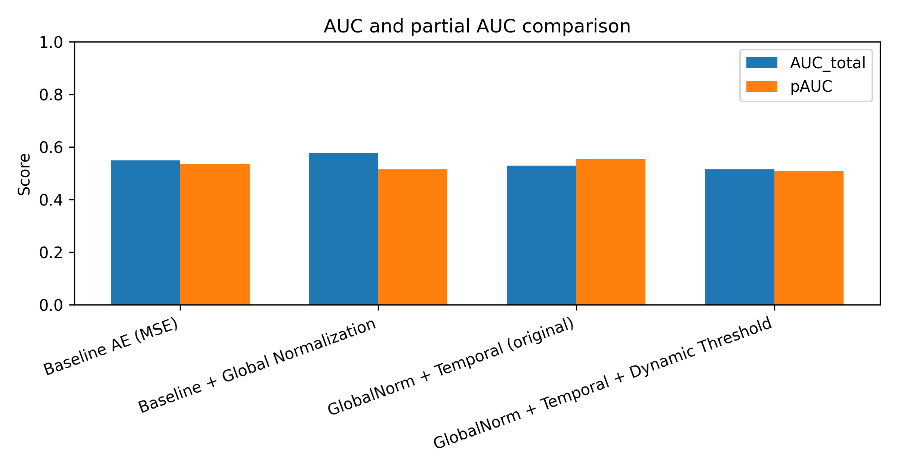
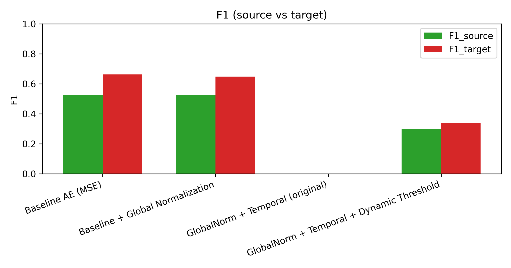
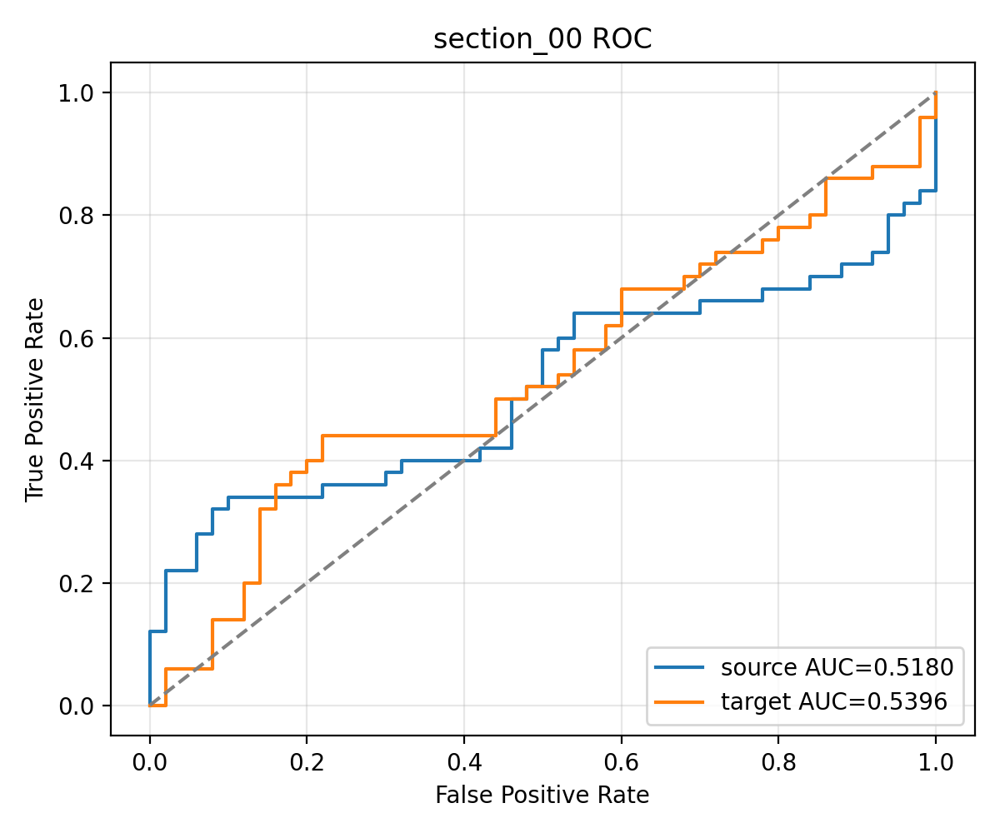

# Final Thesis Analysis

See figures in `results/figures/`.

## Key results
- Baseline AE (MSE): AUC_total = 0.5493, pAUC = 0.5358
- Baseline + Global Normalization (best overall): AUC_total = 0.5766, pAUC = 0.5153
- GlobalNorm + Temporal (best target/pAUC): AUC_target = 0.5376, pAUC = 0.5537
- GlobalNorm + Temporal (domain-calibrated): AUC_total = 0.5143, F1_source = 0.2997, F1_target = 0.3392

